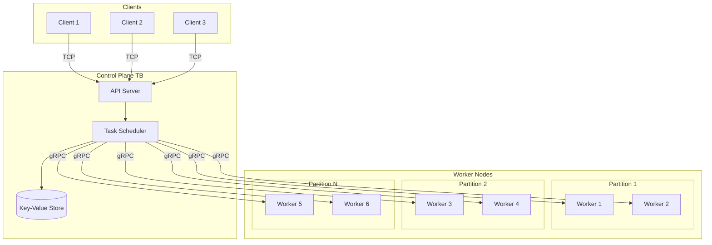

# TM Scheduler
*The Tadashi-Mizu distributed task scheduler*

## Communication Architecture

## Specifications
* Master and Worker nodes that can run across machine boundaries or locally that can communicate via TCP.
* Need internal data store for blob storage? Maybe run against s3 compatible system to pull columnar data in to arrow format??? IDK.
* Tasks are python code that can be submitted to the Master and distributed to worker nodes (maybe? idk might do json or toml first).
* Task data uses Apache Arrow for in memory format.
* Task metadata uses Protocol buffers.
* Uses RocksDB for embedded key value store for metadata. 